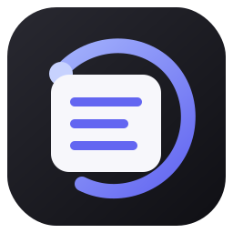
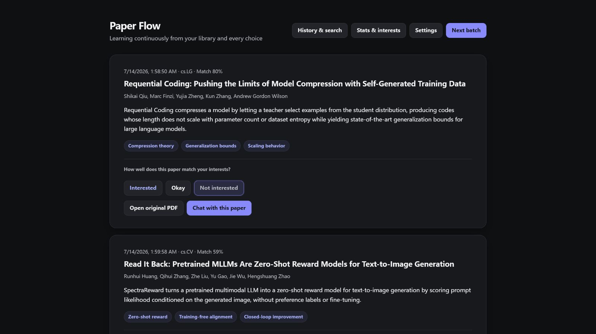
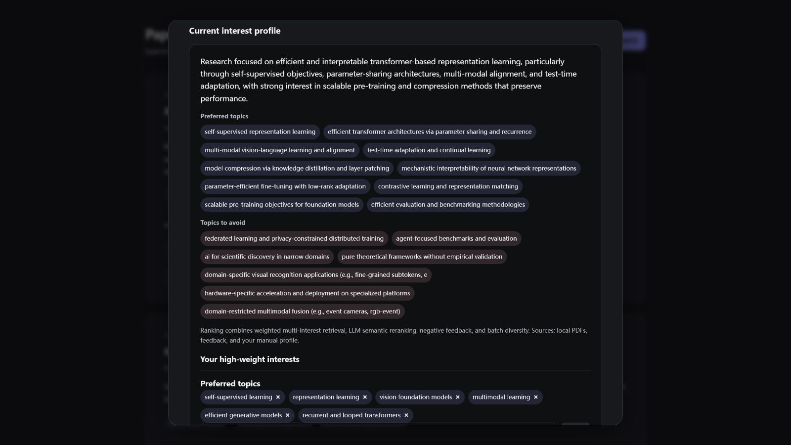
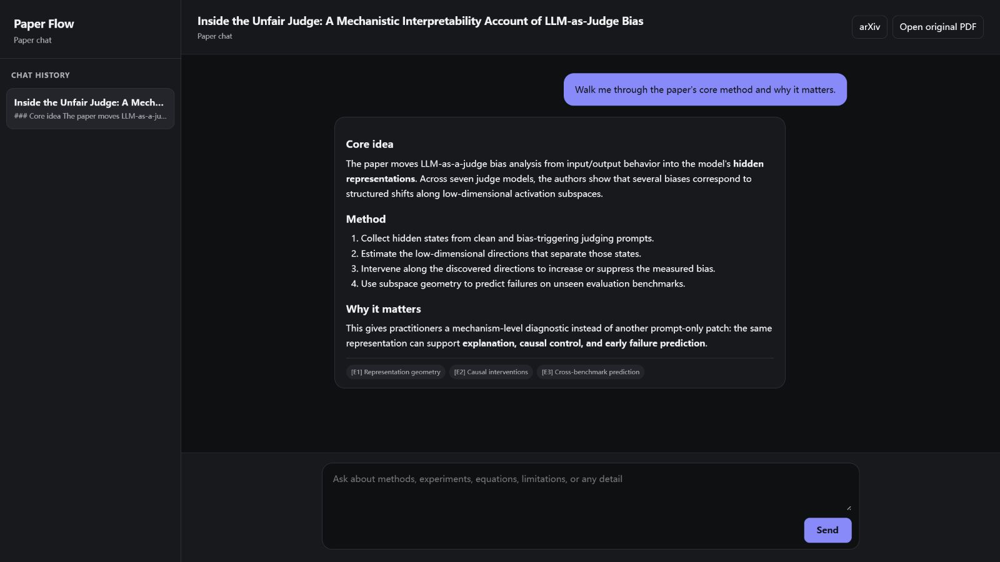

# Paper Flow

[English](README.md) | [简体中文](README_ZH.md)



Paper Flow is a private, local-first arXiv recommender that learns from your PDF library, explicit ratings, and freely editable interests. It combines hybrid local retrieval with LLM semantic screening, then provides evidence-aware chat over full papers.

Current release: **v0.1.1**

## App screenshots

### Personalized recommendation feed

Fine-grained reasons, match scores, explicit preference controls, and separate PDF/chat actions are visible on every paper card.



<p align="center">
  <a href="docs/images/interest-profile.png"></a>
  <a href="docs/images/paper-chat.png"></a>
</p>
<p align="center"><sub>LLM-generated interest profile with high-weight manual controls · Evidence-aware paper chat with Markdown, sources, and history</sub></p>

## Lightweight localhost setup

This is the smallest cross-platform option. It does not require the Windows desktop shell, WebView2, or MinerU.

Requirements: Python 3.13 and [uv](https://docs.astral.sh/uv/).

```bash
git clone https://github.com/kylin0421/paperflow.git
cd paperflow
uv sync
uv run paperflow --host 127.0.0.1 --port 8765
```

Open `http://127.0.0.1:8765`, select a folder containing PDF papers, and configure an OpenAI-compatible API key, base URL, and model names.

## Windows app

Download either `PaperFlow-Setup.exe` or `PaperFlow-portable.zip` from [Releases](https://github.com/kylin0421/paperflow/releases). The portable archive must be extracted in full; `PaperFlow.exe` needs its adjacent `_internal` directory.

To run the desktop shell from source:

```powershell
uv sync --extra desktop
uv run paperflow-desktop
```

The unsigned v0.1.1 build may trigger a Windows SmartScreen warning. The per-user installer does not require administrator privileges and keeps application data after uninstall.

## What v0.1.1 includes

- Fine-grained LLM-generated interests instead of broad arXiv categories, with semantic label merging and unlimited editable preferred/avoided directions.
- Hybrid word/character retrieval, optional embeddings, time-decayed feedback, calibrated LLM screening, multi-interest quotas, MMR diversity, and precision/balanced/explore modes.
- Persistent arXiv candidate caching, separate retrieval and recommendation batch sizes, continued pagination, and durable 429 backoff.
- Auditable recommendation runs with scores, rejection reasons, decision paths, and feedback-based quality metrics.
- Natural-language history search, bilingual UI, dark mode, detailed progress, and cancellable long operations.
- Separate paper-chat window with history, Markdown rendering, task-specific models, and evidence-labelled long-document context.
- One-click managed local MinerU 3.x with an isolated Python 3.12 environment, automatic Worker lifecycle, an optional remote-service mode, and PyMuPDF fallback.
- Versioned SQLite schema, encrypted API keys, connection tests, and built-in backup/restore.

Ratings only change preference. Opening the original PDF or chatting with a paper are separate behaviors and never rate a paper automatically.

## Optional managed MinerU

Select **Install local MinerU** in Advanced Settings. Paper Flow creates an isolated Python 3.12 environment, starts and reuses a loopback-only Worker on demand, and stops it on exit. No API URL or manual service setup is required. MinerU and its models remain optional downloads; without them, Paper Flow uses PyMuPDF. Advanced users can still select a remote MinerU service.

See [MinerU and long-PDF chat](docs/MINERU_EN.md) for setup choices and design details.

## Privacy

The SQLite database is local (`%LOCALAPPDATA%\Paper Flow\state.db` in the Windows app, `~/.paperflow/state.db` for localhost). API keys are protected with Windows DPAPI or a per-installation encrypted key on other systems. arXiv metadata is used for recommendation; full paper content is processed only after the user sends a chat question. Backups and cache controls are available in Settings.

## Documentation

- [Technical architecture](docs/TECHNICAL_EN.md)
- [MinerU and long-PDF chat](docs/MINERU_EN.md)
- [Development, packaging, and release](docs/DEVELOPMENT_EN.md)
- [Changelog](CHANGELOG.md)

## Project origin and license

Paper Flow is developed from [TideDra/zotero-arxiv-daily](https://github.com/TideDra/zotero-arxiv-daily). It replaces Zotero, email delivery, and scheduled workflows with a local interactive application.

Licensed under AGPL-3.0-or-later. See [LICENSE](LICENSE).
